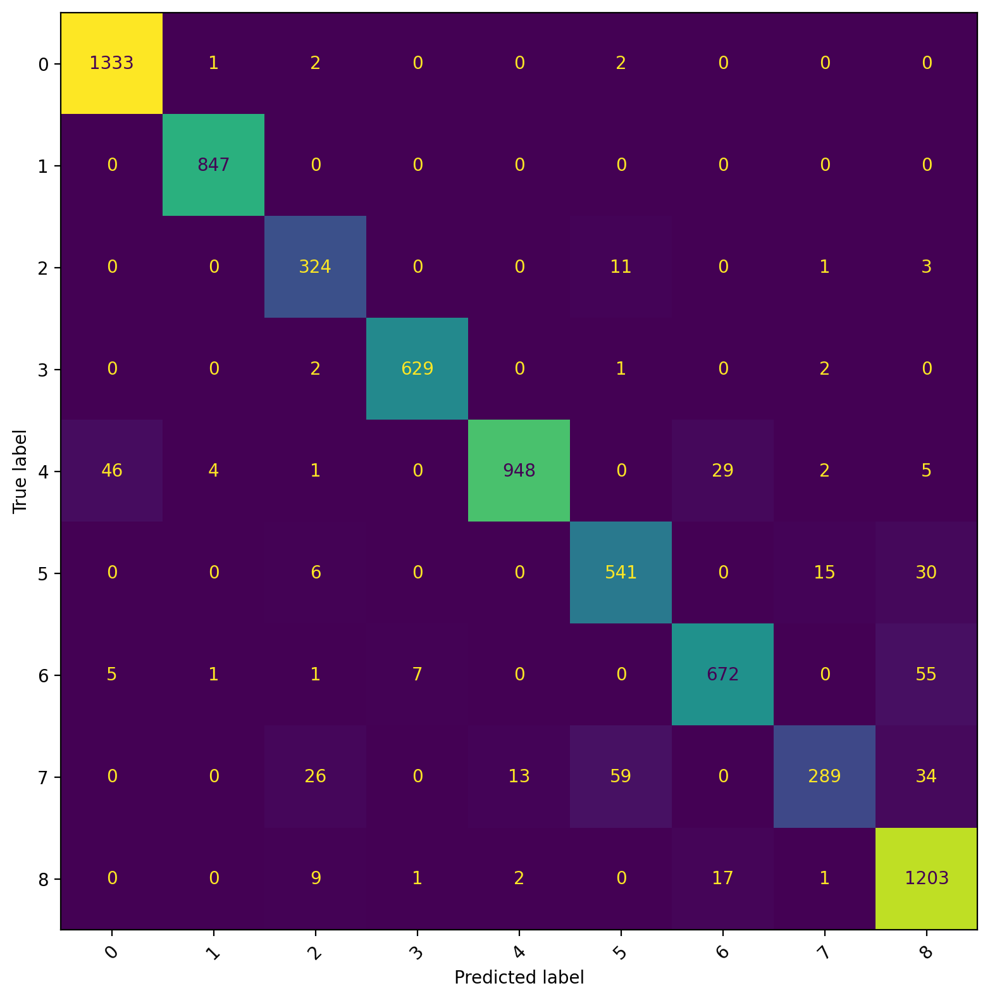

# MedMNIST Image Classification System

This repository contains an end-to-end image classification system built on the MedMNIST dataset.

The goal of this project was not to maximize benchmark performance, but to build a modular, reproducible, and deployable ML system that another engineer could easily understand, run, and extend.

## Overview

The system includes three core components:

1. **Data pipeline**
   - Loads and preprocesses a MedMNIST dataset
   - Applies separate training and evaluation transforms
   - Builds PyTorch datasets and dataloaders

2. **Model training pipeline**
   - Instantiates a configurable image classification model
   - Trains and evaluates the model
   - Reports accuracy, macro F1, AUC, and confusion matrix
   - Saves model checkpoints and run artifacts

3. **Serving layer**
   - Exposes the trained model through a FastAPI service
   - Accepts an uploaded image and returns a prediction

## Dataset and Model Choice

I used **PathMNIST** as the dataset and trained on **64x64 RGB images**.

For the model, I selected **ConvNeXt Atto** (`convnext_atto.d2_in1k`) from `timm`.
I initially validated the pipeline with a ResNet18 baseline, then switched to ConvNeXt Atto as the default architecture because:

- more modern backbone than the baseline models commonly used with MedMNIST
- remains lightweight enough for practical local training and inference
- performed strongly in early experiments while still fitting the scope of the assessment
- demonstrates that the system supports interchangeable architectures through a clean model factory

## Repository Structure

```text
configs/         YAML configuration
scripts/         Entry-point scripts
src/config/      Config loading and saving
src/data/        MedMNIST loading, transforms, dataloaders
src/model/       Model factory
src/training/    Training loop and orchestration
src/evaluation/  Metrics and plots
src/inference/   Prediction logic
src/serving/     FastAPI serving layer
src/utils/       Utilities such as seeding
tests/           Test directory
artifacts/       Saved run outputs
```

## Setup
This project uses Poetry for dependency management. 

### Install dependencies

```bash
poetry install
```

### How to train
Run training from the repository root:
```bash
poetry run python -m scripts.train --config configs/config.yaml
```

This will load the dataset specified in the config, train the model (currently only accepting timm models), save the 
best checkpoint, evaluate on the test set, and write all artifacts to the configured output directory.

#### Training artifacts
After executing a training run, the following artifacts will be saved to the output directory:
- `best_model.pt`
- `history.json`
- `test_metrics.json`
- `config_used.yaml`
- `confusion_matrix.png`


## Launching the serving layer
Start the FastAPI server from the repo root:
```python
poetry run uvicorn src.serving.api:app --reload
```

Then open either:
- Health endpoint: `http://127.0.0.1:8000/health`
- Interactive API docs: `http://127.0.0.1:8000/docs`


### Prediction endpoint
Use the `/predict` endpoint to upload an image and receive a prediction! This response will include a predicted class, label, confidence score and class probabilities.
Just click on the `/predict` endpoint on the `/docs` page, and then find the **Try it out** button. From here you can choose a file to 
upload and execute. Images have been added in the `/sample_api_images` directory for ease of use.

An example trained checkpoint and run artifacts are included in `artifacts/` so the serving layer can be exercised immediately without retraining.


## System configuration
The whole system is driven by a YAML config file located at `configs/config.yaml`. This config controls important variables
such as the dataset choice, the model identifier and source, training hyperparameters, and the output directory. 

## Design Decisions

### Modularity
The system is intentionally split into independent components:

- `MedMNISTDataModule` handles data loading and transforms
- `build_model(...)` handles model instantiation
- `Trainer` handles training and evaluation
- `Predictor` handles inference-time model loading and prediction
- FastAPI exposes the model through a simple serving layer

This separation makes components easier to test, replace, and extend.

### Reproducibility
- randomness is seeded through a shared utility
- the full config used for a run is saved with the artifacts
- metrics and checkpoints are written to disk

### Preprocessing
The training pipeline uses light augmentation for the training split and deterministic preprocessing for validation, test, and serving.

Since the selected backbone is pretrained on ImageNet, RGB inputs are normalized with ImageNet-style mean and standard deviation to better align with the pretrained model's expected input distribution.

## Results

In local experiments, the configured ConvNeXt Atto model produced strong validation and test performance on PathMNIST while keeping the system lightweight and easy to run.

### Example test performance
- Accuracy: 0.9451
- Macro F1: 0.9306
- AUC (OvR): 0.9953

Confusion Matrix:


## Design decisions and corners cut
If I had more time and this were to be a production-ready pipeline, there are several features/improvements I would make.

### Data Pipeline
I would add further augmentations for preprocessing data. Currently, I implemented lightweight augmentations, but my overall goal
would be to allow users to edit training augmentations in the config. 

### Model Training Pipeline
To keep the assessment scoped toward system design rather than benchmark optimization, I used a short training run 
sufficient to validate the end-to-end pipeline and produce representative metrics. In a production or research setting, 
I would run a longer hyperparameter sweep and additional epochs, likely with early stopping and experiment tracking.

Also, I would implement more sources to pull from on top of the current `timm` source implementation. 

Lastly, I would include a better method of model versioning and experiment tracking for better model development.

### Serving Layer
For the scope of the take-home, I implemented a lightweight FastAPI serving layer with health and prediction endpoints. In a production environment, I would extend this with stronger input validation, structured logging, authentication, and monitoring.

### General
One of the most important things I didn't include would be a **test suite**. With more time, I would add unit and 
integration tests around configuration loading, model construction, training, and prediction, along with CI checks for 
formatting and linting. This hurt me to not include, but my time on the assessment was already over the estimate and I didn't want to go overboard.

I also was looking forward to **containerizing** this system, as this is something I've done several times in the past, but again I feel like the work provided already accurately
completed the assessment, and I didn't want to go too far beyond the time estimate allotted. If this is a feature that you'd like to see implemented, I don't mind spending some 
time to update the repository!

Lastly, I would get a little more strict with my **Typing**, and set up various TypedDicts, which would make things a little bit easier to understand within docstrings.

